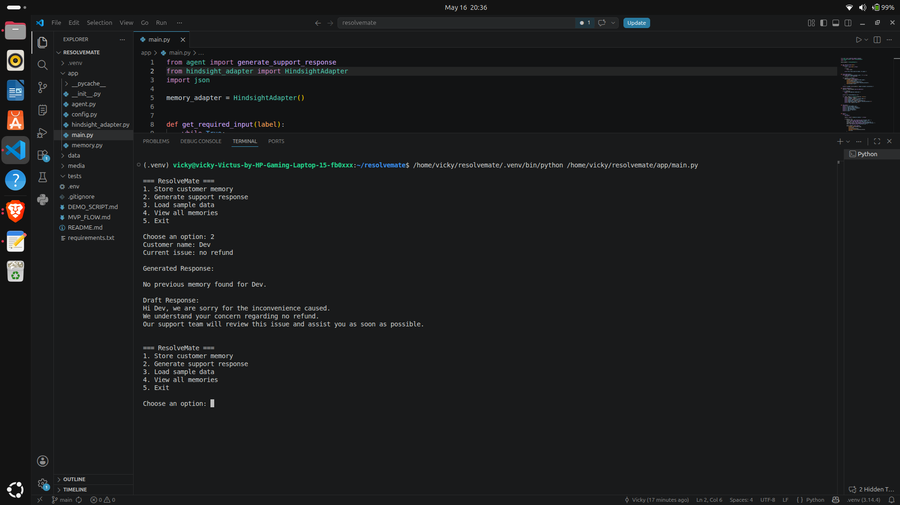
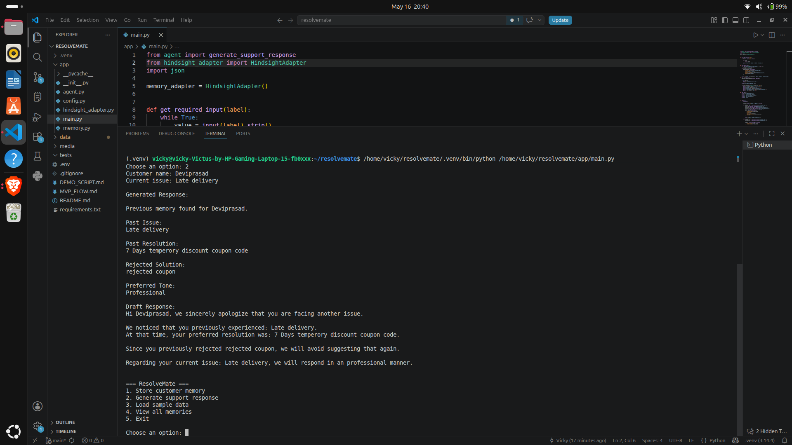
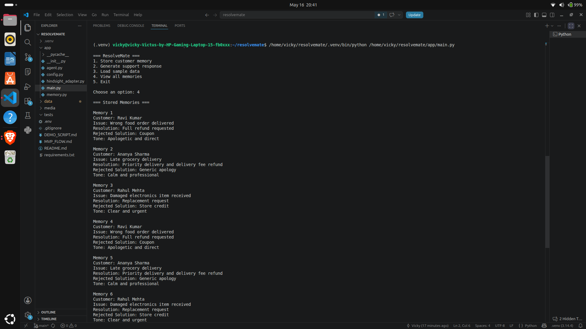

# How Hindsight Helped My Agent Remember Rejected Solutions

## The Problem With Most Support Agents

Most customer support agents respond like every conversation is the first conversation.

A customer complains.
The support team responds.
The customer rejects the solution.
A few days later, the same customer returns with another issue.

The agent forgets everything.

That was the main problem I wanted to solve while building ResolveMate.

ResolveMate is a customer support agent that remembers previous complaints, rejected solutions, preferred tone, and earlier resolutions before generating a response.

Instead of generating generic replies every time, the agent uses memory to produce more context-aware support responses.

## What ResolveMate Does

ResolveMate stores:

- customer complaints
- previous resolutions
- rejected solutions
- preferred response tone

When the customer returns, the agent recalls that information before generating a new support reply.

The core idea is simple:

```text
No memory → generic response
Memory recall → personalized response


## 3. Add screenshot placeholders

Use markdown like this:

```markdown




